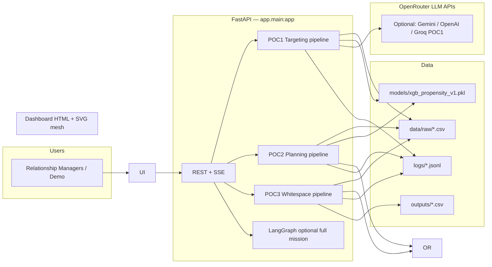
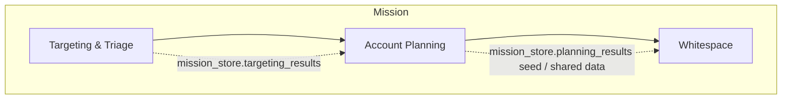
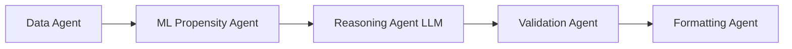
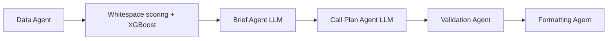
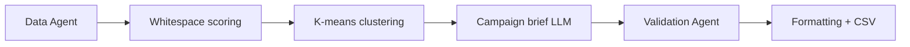

# IQ-EQ Unified Agent Mesh — Architecture (AI Architect Brief)

**Audience:** Executives, product owners, security/governance, and engineering leads.  
**Purpose:** Explain *what* the system does, *how* data flows, *which* models and formulas apply, and *where* to look in code.

**Companion docs:** [`context.md`](context.md) (integration map), [`plan.md`](plan.md) (completed milestones), [`HANDOVER.md`](HANDOVER.md) (runbook & handover).

---

## 1. Executive summary

The **Unified Agent Mesh** is a single FastAPI application that runs three sequential capabilities used in IQ-EQ FAM/PIAO go-to-market workflows:

| Phase | Business name | What it delivers |
|-------|----------------|------------------|
| **1** | Targeting & Triage | Rank accounts (ML propensity + LLM rationale), validate, export NBA-style actions |
| **2** | Account Planning | Per-account strategic brief + tactical call plan (LLM), blended **API score**, governance checks |
| **3** | Whitespace | Country × product **heatmap**, **k-means** account clusters, **LLM** campaign briefs per top cluster, CSV export |

All phases share **CSV-backed data**, **SSE telemetry** (`/events`), **cryptographic audit** (`logs/audit.jsonl`), and a **unified dashboard** at `/`.

---

## 2. System context (C4-style)

---

## 3. End-to-end mission flow

**Stepwise (dashboard tabs):** `POST /run/poc1` → `POST /run/poc2` → `POST /run/poc3` (gated on server state).

**Full mesh (optional):** LangGraph in `app/main.py` chains `targeting → planning → whitespace`.

**Orchestration output loop (conceptual):** Intent is handled by **Orchestration Agent** telemetry (`ag-orch`); work is delegated to **Data → domain agents → Validation → Formatting**, with a **feedback** path from formatting back to orchestration in the UI mesh diagram (dotted connectors).

---

## 4. POC 1 — Targeting & Triage

### 4.1 Pipeline (deterministic order)

| Step | Agent id | Role |
|------|-----------|------|
| Data | `ag-data` | Load & validate `data/raw` tables |
| ML | `ag-ml` | XGBoost **predict_proba** (class 1 = propensity) |
| Reasoning | `ag-reason` | LLM JSON: bucket + rationale per account |
| Validation | `ag-valid` | Cross-check ML vs LLM levels, governance queue |
| Formatting | `ag-fmt` | Final payload + NBA mapping |

**Code:** `app/modules/targeting/targeting_orchestrator.py` → `run_pipeline`.

### 4.2 Algorithm: XGBoost propensity

- **Model artifact:** `models/xgb_propensity_v1.pkl` (expects feature vector in **`FEATURE_ORDER`** from `app/core/constants.py`).
- **Features (order matters):** `win_rate`, `avg_deal_size_eur`, `open_opps_count`, `service_penetration`, `engagement_score`, `launch_indicator`, `tier_1_conf_count`, `growth_metrics_qoq`, `revenue_concentration` — built via `compute_features(account_id, raw_data)` (`app/core/features.py`).
- **Score:** \(p = P(\text{positive} \mid X)\) from **`predict_proba(X)[:, 1]`**.

**Confidence heuristic (POC2 reuse, same family):**

\[
\text{confidence} = \min\left(0.98,\; \frac{|p - 0.5|}{0.5} \times 0.4 + 0.55\right)
\]

### 4.3 LLM (reasoning)

- **Router:** `get_model()` in `app/core/llm_client.py` — priority **Gemini** → **OpenAI** → **Groq** → **OpenRouter** (first available key).
- **Contract:** Structured JSON for triage labels / rationale (LangChain `PromptTemplate | ChatModel`).

### 4.4 Thresholds (ML buckets)

From `app/core/constants.py`:

- **High:** propensity ≥ **0.70**
- **Low:** propensity ≤ **0.30**
- Between: **Medium**

NBA resolution uses deterministic map **`NBA_RESOLUTION`** for buckets A/B/C.

---

## 5. POC 2 — Account Planning

### 5.1 Pipeline

**Code:** `app/modules/planning/planning_orchestrator.py` → `run_account_planning`.

### 5.2 Deterministic formulas

**Expected revenue (bucket → EUR)** — shared with POC3 cell logic:

| Bucket | EUR |
|--------|-----|
| Low | 50,000 |
| Medium | 150,000 |
| High | 300,000 |

**Whitespace flag (matrix row):** whitespace candidate if the account **does not** already have the product (`has_product` / `is_active` semantics) **and** potential bucket is **Medium** or **High**.

**Normalized whitespace potential (batch):** min–max across accounts in the run:

\[
W_{\text{norm}}(a) = \frac{\text{ws\_total}(a) - \min}{\max - \min}
\]
(edge case: all equal → neutral **0.5**)

**API score (blended “planning” score):**

\[
\text{API} = 0.5 \cdot \text{propensity} + 0.3 \cdot W_{\text{norm}} + 0.2 \cdot \mathbb{1}_{\text{strategic}}
\]

Constants: `API_SCORE_WEIGHTS` in `app/core/constants.py`. Implementation: `compute_api_score` in `app/core/features_poc2.py`.

**Relationship depth:**

\[
\text{rel} = 0.4 \cdot \text{norm}(\#contacts) + 0.3 \cdot \text{clip}(\overline{\text{engagement}}) + 0.3 \cdot \text{norm}(\#opps)
\]

**Contact influence:** `ROLE_WEIGHTS × SENIORITY_WEIGHTS × engagement` (role/seniority inferred from text where needed).

### 5.3 LLMs (OpenRouter)

| Use | Module | Env |
|-----|--------|-----|
| Account brief (JSON: brief + call plan text in one pass for brief agent) | `brief_agent.py` → `run_planning_chain` | `OPENROUTER_API_KEY`, optional `POC2_LLM_MODEL` |
| Tactical call plan (JSON markdown) | `call_plan_agent.py` → `run_planning_chain` | Same |
| **Routing** | `get_planning_model()` | OpenRouter **only** for planning; tries `response_format: json_object` then fallback without |

**Resilience:** Global semaphore **`LLM_SEMAPHORE` (3 concurrent)**; planning chain uses **internal retries + backoff** and JSON/non-JSON mode attempts; offline structured brief/call plan if the model fails (`brief_agent.py`, `call_plan_agent.py`).

### 5.4 Validation (governance)

Rules include **high propensity vs low whitespace** and **low propensity vs very high whitespace** bands (`CONFLICT_HIGH_PROPENSITY_WS_MAX`, `CONFLICT_LOW_PROPENSITY_WS_MIN` in `constants.py`). Outputs feed **`governance_queue`** style logging where implemented.

---

## 6. POC 3 — Whitespace analysis

### 6.1 Pipeline

**Code:** `app/modules/whitespace/whitespace_orchestrator.py` → `run_whitespace_pipeline`.

### 6.2 Cell score (heatmap unit)

For each **(account, product)** matrix row that is a whitespace candidate (Medium/High bucket, no existing product):

Let \(R = \text{expected\_revenue\_eur}\) from bucket, \(\hat{R} = R / 300{,}000\). Let \(E\) = expansion weight from catalog (**Low 0.3 / Medium 0.6 / High 1.0**), \(S \in \{0,1\}\) strategic flag.

\[
\text{ws\_score} = \min\left(1,\;0.5 \cdot \hat{R} + 0.3 \cdot E + 0.2 \cdot S\right)
\]

(`WS_SCORE_WEIGHTS` in `app/modules/whitespace/constants.py`, `compute_ws_cell` in `scoring.py`.)

**Heatmap:** Aggregates **expected revenue** (or intensity normalization) by **country × product** for the grid in the API response.

### 6.3 Clustering

- **Input:** Per-account vectors from nonnegative whitespace signals (product-space vector over catalog).
- **Algorithm:** **K-means** (`sklearn.cluster.KMeans`), **`n_clusters = min(K, n_accounts)`** with **`K = 5`** (`KMEANS_K`), fixed **`random_state=42`**, **`n_init=10`**.
- **Output:** Top clusters by total whitespace potential; **up to 3** clusters get **LLM campaign briefs**.

### 6.4 LLM

- **Campaign briefs:** `run_poc3_campaign_chain` — OpenRouter, optional `POC3_LLM_MODEL`, temperature **0.3**, JSON preferred; **fallback brief** on failure (`campaign_brief_agent.py`).

### 6.5 Validation

- **Propensity** (same XGBoost artifact) vs **high ws_score** on **low expansion** products → review flag (`validation_agent.py`, `WS_HIGH_THRESHOLD` **0.7**).

---

## 7. API & integration surface

| Endpoint | Purpose |
|----------|---------|
| `GET /` | Dashboard |
| `GET /events` | SSE agent telemetry |
| `POST /run/poc1` | Targeting pipeline (await) |
| `POST /run/poc2` | Planning (requires targeting in `mission_store`) |
| `POST /run/poc3` | Whitespace (optional JSON filters) |
| `POST /execute_mission` | Full LangGraph 1→2→3 (async background) |
| `GET /mission_results` | Last `targeting`, `planning`, `whitespace` JSON |
| `POST /analyze_whitespace` | POC3-only API |

**Progress tracker:** `app/core/progress_tracker.py` — event payload includes `agent_name`, `status`, `message`, `timestamp`, optional `agent_type`, `stage`.

---

## 8. Security, compliance, and limits (talk track)

- **ISO 42001** badge in UI is **demonstration positioning**; real compliance would extend to model cards, DPIA, access control — **not fully implemented** in this POC.
- **Secrets:** `.env` — never commit; keys for OpenRouter / optional Gemini / OpenAI / Groq.
- **Audit:** `log_audit` hashes inputs/outputs lineage in `logs/audit.jsonl`.
- **Rate / concurrency:** Max **3** parallel LLM calls via semaphore; retries with backoff on chains.
- **Data residency:** All demo data is **local CSV**; LLM calls go to **configured cloud endpoints** (OpenRouter, etc.).

---

## 9. Diagram: telemetry ↔ dashboard mesh

Mesh node IDs should match `tracker.emit` names for highlighting:

`ag-orch`, `ag-data`, `ag-ml`, `ag-ws`, `ag-brief`, `ag-reason`, `ag-call`, `ag-camp`, `ag-valid`, `ag-fmt`.

SVG source: `app/static/mesh_architecture.svg`.

---

## 10. Glossary

| Term | Meaning |
|------|---------|
| **API score** | POC2 blended score: propensity + normalized whitespace + strategic |
| **NBA** | Next Best Action (deterministic map from priority bucket) |
| **Whitespace** | Revenue opportunity where product is **not** yet active but potential bucket is medium/high |
| **OpenRouter** | LLM gateway; single key can route to multiple model providers |

---

## 11. Critical review — gaps & stakeholder scrutiny (VP Sales Ops, analytics, CRM)

Use this section when **IQ-EQ** leaders ask whether the demo is *statistically sound* or *finance-grade*. **Bottom line:** the mesh is a **coherent orchestration POC** with explicit formulas, but several choices are **heuristic or requirements-locked**, not empirically validated on your production book. Say clearly: *“decision support prototype — not a certified pricing or risk engine.”*

### 11.1 Statistician / data science

| Topic | What the code does | Gap / risk |
|--------|-------------------|------------|
| **Propensity** | XGBoost `predict_proba[:,1]` on9 engineered features | No documented **calibration** (Platt / isotonic) for “probability of win” language; scores are **ranking-oriented** unless the model was trained and tested with proper calibration on IQ-EQ data. |
| **“Confidence”** | `min(0.98, (|p−0.5|/0.5)*0.4 + 0.55)` | This is a **display heuristic**, not posterior uncertainty, bootstrap CI, or conformal coverage. **Do not** interpret as statistical confidence interval. |
| **API score** | Fixed weights0.5 / 0.3 / 0.2 (propensity / norm WS / strategic) | **Arbitrary linear blend** unless tied to uplift or revenue outcome models. Different segments may need different weights; no interaction terms or elasticity. |
| **Whitespace normalization** | Min–max of **total** whitespace EUR across the **batch in the run** | Rankings **shift** if you change the account set (inclusion/exclusion). Not stable against cohort composition — classic **leakage of scale** into interpretation. |
| **K-means** | `k = min(5, n)` on account vectors (max `ws_score` per product dimension) | Assumes Euclidean geometry and spherical clusters; **no** silhouette-driven *k*, no hierarchical structure, sensitive to **scale** and **sparse** high-dimensional product space. Fine for **demo segmentation**, weak for **strategic cluster definitions** without qualitative validation. |
| **Train–serve** | Single pickle; fallback neutral 0.5 if missing | No online drift monitoring, no A/B, no recency of retrain disclosed in-app. |

**Verdict:** Internally **consistent** math; **not** a mismatch of symbols vs code, but **epistemic** gaps: calibration, uncertainty, and cohort stability.

### 11.2 Financial advisor / revenue integrity

| Topic | What the code does | Gap / risk |
|--------|-------------------|------------|
| **Expected revenue** | Discrete buckets: Low **50k**, Medium **150k**, High **300k** EUR | **Point estimates** from buckets, not distributions, not NPV, not probability-weighted scenarios. Summing cells **double-counts** narrative risk if buckets are not mutually exclusive outcomes. |
| **POC3 totals** | Sums `expected_revenue_eur` across whitespace cells per account / country–product | **Additive** implied “potential” can exceed realistic wallet share; no **cannibalization**, **capacity**, or **single-winner** constraints. |
| **Currency** | EUR labels | No FX, no fiscal year alignment, no contract timing. |

**Verdict:** Good for **relative** heatmaps and **storytelling**; **do not** present summed EUR as **forecast** or **quota** without a finance sign-off and definitions of “expected.”

### 11.3 VP Sales Ops

| Topic | What the code does | Gap / risk |
|--------|-------------------|------------|
| **Prioritization** | ML bucket + LLM rationale + NBA mapping | LLM **narrative** can diverge from ML bucket; validation catches **some** propensity vs whitespace mismatches, but not full **playbook** alignment to territories, coverage models, or comp rules. |
| **Conflict rules** | e.g. high propensity & WS &lt; 50k EUR; low propensity & WS &gt; 500k EUR | Thresholds are **constants** in code — not tuned from win-rate data in this repo. |
| **Actionability** | Brief + call plan + campaign text | Outputs are **not** written back to CRM in this POC; **no** closed-loop measurement of “brief sent → meeting booked.” |

**Verdict:** Strong **demo** of agentic workflow; **operational** rollout needs CRM integration, guardrails, and KPI linkage.

### 11.4 Data analytics / CRM owner (IQ-EQ.com)

| Topic | What the code does | Gap / risk |
|--------|-------------------|------------|
| **Source of truth** | Local **CSV** only | No **Salesforce / Dynamics** field-level mapping, no **GDPR** residency story per tenant, no **golden record** merge rules. |
| **Matrix semantics** | `has_product` / `is_active` / `potential_revenue_bucket` | If CRM **hygiene** is poor, whitespace flags are **wrong**; demo data is curated — production requires **data quality SLAs**. |
| **Audit** | `audit.jsonl` + governance flags | Useful for **POC** traceability; not a full **model inventory** or **lineage** product (e.g. MLflow, OpenLineage). |
| **LLM PII** | Account/contact snippets sent to OpenRouter (or other providers) | **DPA**, **subprocessor** list, and **redaction** policy must be explicit before production. |

**Verdict:** Architecture is **explainable** (formulas in §5–6); **trust** depends on **data contract** and **governance** outside this repo.

### 11.5 Formula “mismatch” summary

There is **no** discovered bug where the documented formula in §5–6 **disagrees** with `features_poc2.py` / `scoring.py` for the **same inputs**. The **critical** issue is **fitness for purpose**: weights, buckets, and “confidence” are **requirements/demo choices**, not statistically **estimated** from IQ-EQ outcomes in this codebase.

### 11.6 Recommended talk track for executives

1. **“This shows how agents orchestrate ML + rules + LLM with audit hooks.”**  
2. **“Numbers are illustrative — buckets and blend weights come from the POC spec; production would calibrate on your book and finance definitions.”**  
3. **“Confidence on screen is a UX scalar, not a 95% interval.”**  
4. **“Whitespace totals are directional heat, not booked pipeline.”**

---

*Document version: 2026-04 — aligned with repo root `app/` implementation.*
