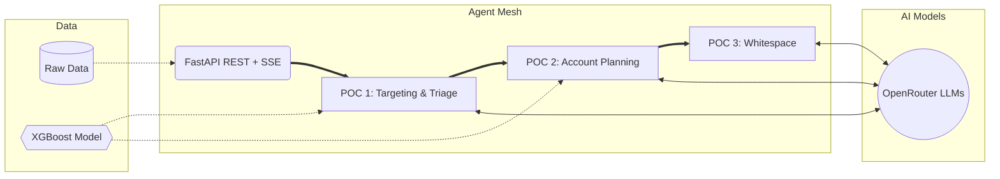

  <h1>🚀 IQ-EQ Unified Agent Mesh</h1>
  
<strong>Systematically identifying and unlocking hidden revenue-generating opportunities within IQ-EQ's existing client portfolios.</strong>

  
  
  
  
  
  

---

## 🎯 Objective

The **Unified Agent Mesh** automates the prioritization of accounts, generates highly personalized strategic campaign briefs, and recommends specific cross-sell/upsell product pathways. By blending **deterministic Machine Learning** with **Generative AI reasoning**, the system maximizes growth while optimizing sales team effort.

> **Key Takeaway:** Move from "gut-feeling" selling to mathematically and strategically prioritized outreach.

---

## 🏗️ Architecture at a Glance

The application consists of three core Proof of Concept (POC) pipelines orchestrated by a unified FastAPI mesh.

---

## ⚙️ Core Workflows

The architecture is split into three sequential pipelines:

| Phase | Pipeline | What it Delivers |
| :--- | :--- | :--- |
| **1️⃣** | **Targeting & Triage** | Evaluates the client base to identify *who* to target. Blends mathematical propensity with strategic rationale to bucket accounts (e.g., Bucket A: Immediate Action). |
| **2️⃣** | **Account Planning** | Automates manual research. Identifies decision-makers, evaluates financial upside, and drafts tailored outreach strategies via LLMs. |
| **3️⃣** | **Whitespace Analysis** | Uses K-Means clustering to discover shared product needs. Determines exactly *what* products should be pitched based on high-performing profiles. |

> 🛡️ **Governance Agent:** At every step, the system actively catches logical flaws (e.g., "Conflicts" where high propensity meets low whitespace potential), preventing wasted marketing spend.

---

## 🧠 Hybrid AI Architecture

This project utilizes a powerful "Agent Mesh" combining both predictive and generative capabilities:

### 📊 Machine Learning (Predictive)
* **XGBoost:** Calculates the core ML Propensity Score (statistical probability of purchase).
* **Isotonic Regression:** Calibrates the probabilities.
* **K-Means Clustering:** Groups similar accounts to discover product needs.

### 💬 Generative AI (Reasoning & NLP)
* **LLMs via OpenRouter:** Analyzes CRM context, summarizes qualitative data, and generates strategic campaign briefs and messaging angles.

---

## 📈 Metrics and KPIs Generated

The system computes several critical KPIs for each account:

* **ML Propensity Score:** 0-100% likelihood of buying.
* **LLM Context Level:** High/Medium/Low qualitative readiness.
* **Whitespace Potential (€):** Estimated value of un-sold cross-sell opportunities.
* **Account Rank / Bucket:** Prioritization tiers (A, B, C) for sales focus.
* **Conflict Flags:** Governance metrics identifying data contradictions.
* **Cluster IDs:** Behavioral groupings linking accounts to product propensity.

---

## 💼 Business Impact

* 🚀 **Revenue Maximization:** Uncovers hidden cross-sell/upsell pathways.
* ⚡ **Sales Efficiency:** Sales directors only spend time on accounts mathematically likely to convert.
* ⏱️ **Time Savings:** Replaces hours of manual research by auto-generating complete campaign briefs.
* 🎯 **Strategic Accuracy:** Governance engine prevents misaligned product pitches.

---

  <i>For detailed architecture and model documentation, see <a href="ARCHITECTURE.md">ARCHITECTURE.md</a></i>

