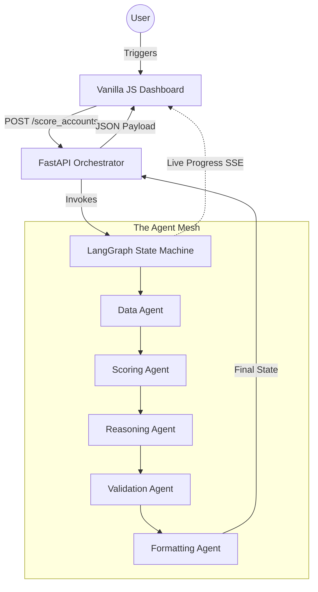
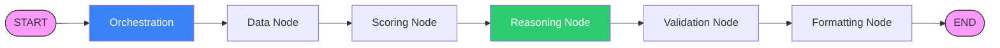

# IQ-EQ Agent Mesh Dashboard: Technical Learning Guide

This guide provides a comprehensive breakdown of the Targeting & Triage system, covering architecture, data science logic, and agentic orchestration.

---

## 1. High-Level Architecture
The system is built on a "Decoupled Dash" architecture. The frontend provides real-time visualization, while the backend utilizes a formal LangGraph State Machine to manage intelligence.

---

## 2. Technical Stack
*   **Orchestration**: `LangGraph` (Directed Acyclic Graph for agents).
*   **LLM Framework**: `LangChain` (LCEL) for prompt & model management.
*   **Models**: 
    - **ML**: `XGBoost` (Extreme Gradient Boosting).
    - **LLM**: `Gemini 2.0 Flash` (Primary), `GPT-4o` (Fallback).
*   **Data Operations**: `Pandas`, `NumPy`.
*   **API Layer**: `FastAPI` with `Server-Sent Events (SSE)`.

---

## 3. End-to-End Agent Flow
The pipeline follows a strict 6-node sequence defined in the LangGraph State Machine.

---

## 4. Agent Deep-Dives

### 4.1 Data Agent (The Feature Engineer)
This agent performs real-time feature engineering using the following financial formulas:
*   **Win Rate**: $\frac{\text{Won Deals}}{\max(1, \text{Won} + \text{Lost})}$
*   **Engagement Score**: $\text{Base} + (5 \times \text{Attendees}) + (10 \times \text{High Signal Events})$
*   **Revenue Concentration**: Share of wallet metric pulled from Snowflake.

### 4.2 Scoring Agent (The ML Engine)
*   **Algorithm**: **XGBoost**. This extreme gradient boosting model is trained on a 9-feature vector.
*   **Concept: Probability Calibration**: We apply **Isotonic Regression** to raw ML scores. This ensures that the probability output is "Real World Scaled" (i.e., a 0.7 score actually means a 70% conversion chance).

### 4.3 Reasoning Agent (The Strategic Analyst)
Powered by **LangChain**, this agent uses **Thematic Weighting** to prioritize signals:
*   **60% Historical Weight**: Mentions Win Rate or Deal Size.
*   **80% Firmographic Fit**: Mentions Revenue Concentration and Segment.
*   **100% Timing Signal**: Prioritizes recent **Fund Launches** (90-day window) and **Conference Attendance**.
*   **AI Prompting**: Uses **Zero-Shot JSON output** prompts to ensure deterministic integration with the mesh.

### 4.4 Validation Agent (The Auditor)
Uses a **Conflict Detection Matrix** to identify "ML vs. Human-like Reasoning" gaps:
*   **Logic**: If (ML == "High") AND (LLM == "Low"), then `conflict_flag = True`.
*   **Output**: All flagged accounts are pushed to the `governance_queue.jsonl` for human review.

### 4.5 Formatting Agent (The Translator)
Uses **Pydantic Schema Enforcement** to finalize the response. It maps the LLM's priority bucket (A, B, or C) to a **Deterministic NBA Rule**:
*   **Bucket A**: Call within 5 days.
*   **Bucket B**: Send targeted brief.
*   **Bucket C**: Schedule quarterly check-in.

---

## 5. Core AI & Architecture Concepts

| Concept | Purpose |
| :--- | :--- |
| **LangGraph Nodes** | Ensures every agent is modular; a node can be replaced or added without breaking the mesh. |
| **SSE (Event Streaming)** | Allows the dashboard to "see" the AI thinking in real-time (typewriter effect). |
| **SHA-256 Audit Traces** | Every decision is hashed to ensure it cannot be tampered with after the run. |
| **Exponential Retries** | Uses `tenacity` to automatically retry failed agent nodes (3x) with backoff. |
| **Concurrency Semaphore**| Constrains parallel LLM calls to 3 to prevent API rate-limit exhaustion. |

---

## 6. Operational Resilience
The mesh is designed to handle the "messiness" of real-world APIs:
1. **The Semaphore Pattern**: By using an `asyncio.Semaphore(3)`, we ensure that if we are triaging 50 accounts, we don't spam 50 parallel requests. This prevents the "429 Too Many Requests" error.
2. **Exponential Backoff**: If an agent node fails (network blip), it waits 4 seconds, then 8, then 10 before finally giving up. This 3-attempt strategy significantly improves pipeline reliability in unstable network conditions.

---

## 7. Future Scalability (POC 2 & 3)
Because the foundation is now built on **LangGraph**, we can easily add:
*   **Conditional Loops**: If Validation fails, the graph can automatically loop back to the Reasoning node for a second attempt.
*   **Parallel Agents**: We can run multiple "Analysis" agents at the same time and aggregate their results.
